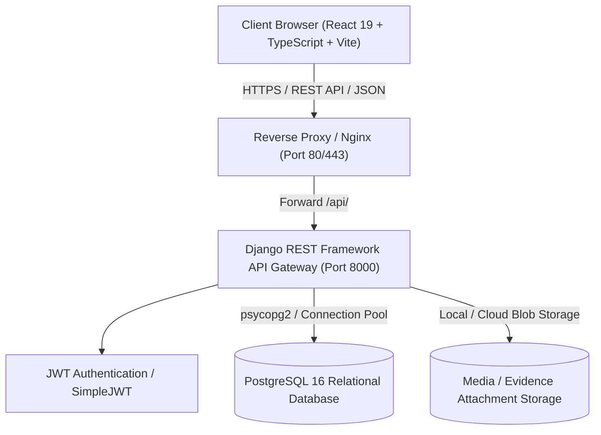
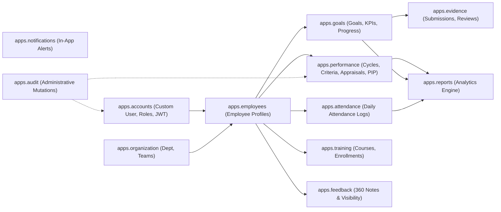
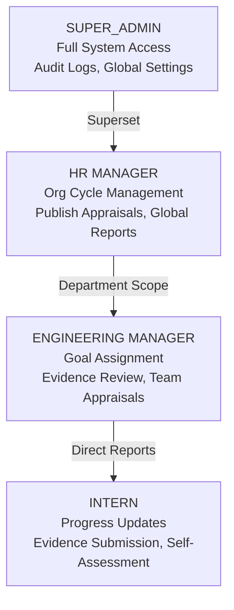
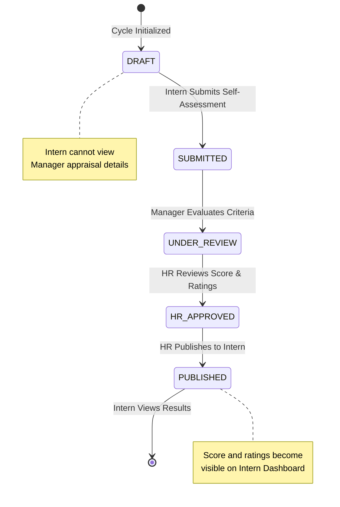

# Architecture Specification — Intern Performance Management System (PMS)

## 1. Executive Summary

The **Intern Performance Management System (PMS)** is an enterprise web platform designed to administer intern onboarding, objective alignment, evidence-backed progress logging, multi-stage performance evaluations, and executive analytics. 

While inspired by the legacy Spring Boot EPMS reference implementation, this system transitions the backend to a modular **Python / Django 5.1 / Django REST Framework** architecture backed by a normalized **PostgreSQL 16** relational store, paired with a modern **React 19 / TypeScript** single-page frontend.

---

## 2. High-Level System Architecture

### Layer Separation
1. **Presentation Layer:** React 19 SPA running with Vite, TypeScript, Tailwind CSS, and Redux Toolkit with RTK Query.
2. **API & Business Logic Layer:** Django 5.1 REST framework with custom permission classes, domain-driven apps, service classes (`ScoringService`, `AnalyticsService`, `AuditService`), and OpenAPI 3.0 schema generation (`drf-spectacular`).
3. **Data Persistence Layer:** PostgreSQL 16 with UUID v4 primary keys, strict foreign key constraints, composite unique indexes, and audit timestamps across all tables.

---

## 3. Modular Django App Architecture

The backend repository (`backend/apps/`) is divided into 11 decoupled domain applications:

### Domain App Responsibilities

| Application | Primary Models & Services | Core Responsibilities |
|---|---|---|
| `apps.accounts` | `User`, `UserRole`, `CustomTokenObtainPairSerializer` | User identity, password security, JWT claims injection (`role`, `profile_id`), role-based authorization guards. |
| `apps.organization` | `Department`, `Team`, `TeamMembership` | Organizational hierarchies, team leads, department allocations. |
| `apps.employees` | `EmployeeProfile`, `EmploymentStatus` | Intern and manager profiles, employee codes, direct reporting manager links. |
| `apps.goals` | `Goal`, `KPI`, `GoalProgress` | Goal setting, weight distributions, KPI metrics, progress logs. |
| `apps.evidence` | `EvidenceSubmission`, `EvidenceReviewStatus` | Proof attachment (files/URLs), manager review, revision cycles. |
| `apps.performance` | `PerformanceCycle`, `EvaluationCriterion`, `Appraisal`, `AppraisalRating`, `PIP`, `RecognitionReward`, `ScoringService` | Cycles, scoring policy weights, multi-phase appraisal review lifecycle, PIP tracking. |
| `apps.attendance` | `AttendanceRecord`, `AttendanceStatus` | Daily presence, half-day, and leave tracking with unique date constraints. |
| `apps.training` | `TrainingCourse`, `EmployeeTraining` | Curriculum definition, intern enrollment, course completion rates. |
| `apps.feedback` | `Feedback`, `FeedbackVisibility` | Continuous peer/manager feedback with visibility controls (`PUBLIC`, `MANAGER_ONLY`, `PRIVATE`). |
| `apps.notifications` | `Notification` | Event alerts (goal assigned, evidence reviewed, appraisal published). |
| `apps.reports` | `AnalyticsService`, `MyPerformanceReportView`, `TeamPerformanceReportView`, `OrganizationPerformanceReportView` | SQL aggregations, bell-curve scoring, export to CSV. |
| `apps.audit` | `AuditLog`, `AuditService` | Immutable tamper-evident logging of administrative and appraisal state changes. |

---

## 4. Role-Based Access Control (RBAC) Matrix

Security enforcement operates at both the route level and object level in Django REST Framework.

| Resource / Action | INTERN | MANAGER | HR | SUPER_ADMIN |
|---|---|---|---|---|
| View own profile & goals | ✅ | ✅ | ✅ | ✅ |
| Update goal progress percentage | ✅ (Own) | ❌ | ❌ | ❌ |
| Submit evidence attachments | ✅ (Own) | ❌ | ❌ | ❌ |
| Review / Approve evidence | ❌ | ✅ (Team) | ✅ | ✅ |
| Create & Assign Goals | ❌ | ✅ (Team) | ✅ | ✅ |
| Submit Self-Assessment | ✅ (Own) | ❌ | ❌ | ❌ |
| Conduct Manager Appraisal | ❌ | ✅ (Team) | ✅ | ✅ |
| Publish Final Appraisal | ❌ | ❌ | ✅ | ✅ |
| View Published Appraisal | ✅ (Own Published Only) | ✅ (Team) | ✅ | ✅ |
| View Unpublished Appraisal Drafts | ❌ (Strictly Blocked) | ✅ (Team) | ✅ | ✅ |
| Create / Edit Training Courses | ❌ | ❌ | ✅ | ✅ |
| Manage Performance Cycles & Weights | ❌ | ❌ | ✅ | ✅ |
| View Team Performance Analytics | ❌ | ✅ (Team) | ✅ | ✅ |
| View Organization Bell Curve | ❌ | ❌ | ✅ | ✅ |
| View System Audit Logs | ❌ | ❌ | ❌ | ✅ |

---

## 5. Scoring Service & Mathematical Formulation

The `ScoringService` (`backend/apps/performance/services/scoring.py`) calculates overall intern performance based on HR-configured weights and reproducible mathematical formulas:

$$\text{Final Score} = \left( \text{Goal Completion} \times W_{\text{goals}} \right) + \left( \text{Manager Criteria} \times W_{\text{criteria}} \right) + \left( \text{Self-Assessment} \times W_{\text{self}} \right)$$

### Default Weight Configuration
- **Goal & KPI Completion:** 40% ($W_{\text{goals}} = 0.40$)
  - Calculated as the arithmetic mean of all assigned goals' completion percentages for the cycle:
    $$\text{Goal Score} = \frac{1}{N} \sum_{i=1}^{N} \text{Goal}_i\%$$
- **Manager Criteria Evaluation:** 40% ($W_{\text{criteria}} = 0.40$)
  - Calculated from weighted criterion ratings:
    $$\text{Criteria Score} = \sum_{c} \left( \frac{\text{Rating}_c}{\text{Max}_c} \times \text{Weight}_c \right)$$
- **Self-Assessment Rating:** 20% ($W_{\text{self}} = 0.20$)
  - Provided by the intern during self-evaluation.

### Grade Mapping Thresholds
- **90.00% – 100.00%:** Outstanding ($A+$ / Exceeds All Expectations)
- **80.00% – 89.99%:** Exceeds Expectations ($A$)
- **70.00% – 79.99%:** Meets Expectations ($B$)
- **60.00% – 69.99%:** Needs Improvement ($C$)
- **< 60.00%:** Unsatisfactory ($D$ / Candidate for PIP)

---

## 6. Appraisal Lifecycle State Machine

---

## 7. Database Integrity & Constraints

1. **UUID v4 Identifiers:** Mitigate ID enumeration and cross-tenant leakage.
2. **Composite Uniqueness:**
   - `(employee, attendance_date)` on `AttendanceRecord`: Eliminates double-clocking.
   - `(employee, course)` on `EmployeeTraining`: Prevents duplicate enrollments.
   - `(appraisal, criterion)` on `AppraisalRating`: Guarantees one score per criterion per review.
   - `(team, employee)` on `TeamMembership`: Prevents duplicate team assignments.
3. **Foreign Key Integrity:**
   - Critical dependencies (e.g. `User -> EmployeeProfile`) use `CASCADE` on account deletion.
   - Manager reassignments use `SET_NULL` to retain historical records when leadership transitions.
4. **Precision Decimal Types:** `DecimalField(max_digits=5, decimal_places=2)` prevents floating-point inaccuracies in financial, weighting, and performance scores.
