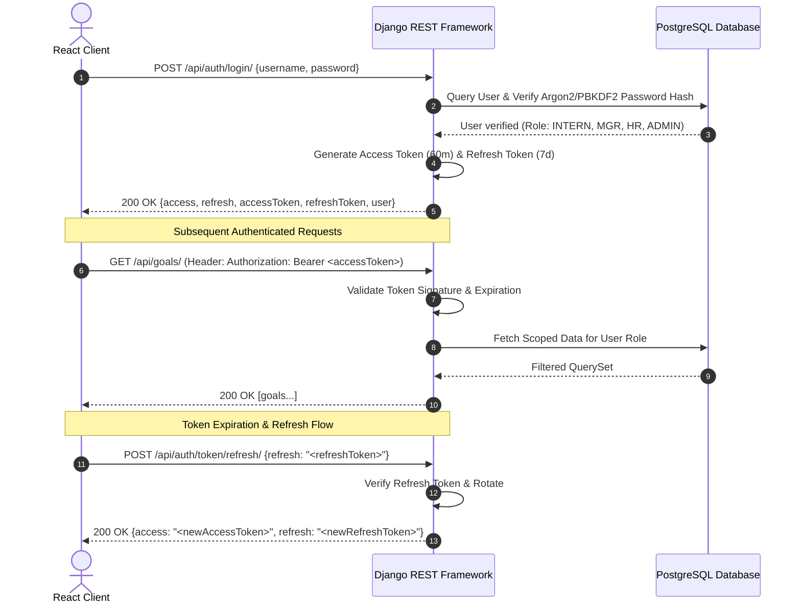

# Authentication & Security Specification — Intern PMS

## 1. Overview

The **Intern Performance Management System (PMS)** uses stateless JSON Web Token (JWT) authentication provided by `djangorestframework-simplejwt` with custom claims injection and role-based access validation.

---

## 2. JWT Architecture & Token Lifecycle



### Key Parameters
- **Algorithm:** `HS256` (HMAC SHA-256) signed with `SECRET_KEY`.
- **Access Token Expiry:** 60 minutes (`JWT_ACCESS_TOKEN_LIFETIME_MINUTES`).
- **Refresh Token Expiry:** 7 days (`JWT_REFRESH_TOKEN_LIFETIME_DAYS`).
- **Token Rotation:** `ROTATE_REFRESH_TOKENS = True` (Issuing a new refresh token whenever refreshed).
- **Blacklisting:** `BLACKLIST_AFTER_ROTATION = True` (Revoking old refresh tokens immediately upon rotation).

---

## 3. Token Payload Structure

Each JWT access token encapsulates the following claims:

```json
{
  "token_type": "access",
  "exp": 1758286800,
  "iat": 1758283200,
  "jti": "4b68e7b92f7c469ca30dfecff4852924",
  "user_id": "9cb3897b-91f4-41d3-8822-488b0e77d248",
  "role": "INTERN",
  "username": "intern_alex",
  "email": "alex.dev@company.com"
}
```

---

## 4. Endpoints Reference

### 4.1 Login / Token Obtain
- **URL:** `/api/auth/login/`
- **Method:** `POST`
- **Auth Required:** No

#### Request Payload
```json
{
  "username": "intern_alex",
  "password": "AlexPassword123!"
}
```

#### Success Response (`200 OK`)
```json
{
  "access": "eyJhbGciOiJIUzI1NiIsInR5cCI6IkpXVCJ9...",
  "refresh": "eyJhbGciOiJIUzI1NiIsInR5cCI6IkpXVCJ9...",
  "accessToken": "eyJhbGciOiJIUzI1NiIsInR5cCI6IkpXVCJ9...",
  "refreshToken": "eyJhbGciOiJIUzI1NiIsInR5cCI6IkpXVCJ9...",
  "user": {
    "id": "9cb3897b-91f4-41d3-8822-488b0e77d248",
    "username": "intern_alex",
    "email": "alex.dev@company.com",
    "role": "INTERN",
    "profile": {
      "id": "5fa23281-a1b7-4c4f-9e77-2eec3081e618",
      "employee_code": "INT-2025-001",
      "full_name": "Alex Chen",
      "designation": "Backend Software Intern",
      "department": "Engineering",
      "manager_id": "b3e0d691-628b-4029-9e73-b3c14d9a6c11"
    }
  }
}
```

---

### 4.2 Token Refresh
- **URL:** `/api/auth/token/refresh/` or `/api/auth/refresh-token/`
- **Method:** `POST`
- **Auth Required:** No

#### Request Payload
```json
{
  "refresh": "eyJhbGciOiJIUzI1NiIsInR5cCI6IkpXVCJ9..."
}
```

#### Success Response (`200 OK`)
```json
{
  "access": "eyJhbGciOiJIUzI1NiIsInR5cCI6IkpXVCJ9...",
  "refresh": "eyJhbGciOiJIUzI1NiIsInR5cCI6IkpXVCJ9..."
}
```

---

### 4.3 Current Authenticated User (`/me`)
- **URL:** `/api/auth/me/`
- **Method:** `GET`
- **Headers:** `Authorization: Bearer <accessToken>`

#### Success Response (`200 OK`)
```json
{
  "id": "9cb3897b-91f4-41d3-8822-488b0e77d248",
  "username": "intern_alex",
  "email": "alex.dev@company.com",
  "role": "INTERN",
  "is_active": true,
  "date_joined": "2025-06-01T09:00:00Z",
  "profile": {
    "id": "5fa23281-a1b7-4c4f-9e77-2eec3081e618",
    "employee_code": "INT-2025-001",
    "first_name": "Alex",
    "last_name": "Chen",
    "full_name": "Alex Chen",
    "designation": "Backend Software Intern",
    "department_id": "8f83b194-c119-482d-8957-827cfa4a34b2",
    "department_name": "Engineering",
    "manager_id": "b3e0d691-628b-4029-9e73-b3c14d9a6c11",
    "manager_name": "manager_marcus",
    "joining_date": "2025-06-01",
    "employment_status": "ACTIVE",
    "phone_number": "+1-555-0201"
  }
}
```

---

### 4.4 Change Password
- **URL:** `/api/auth/change-password/`
- **Method:** `POST`
- **Headers:** `Authorization: Bearer <accessToken>`

#### Request Payload
```json
{
  "old_password": "AlexPassword123!",
  "new_password": "NewSecureAlexPassword2025!"
}
```

#### Success Response (`200 OK`)
```json
{
  "detail": "Password updated successfully."
}
```

---

## 5. Built-in Demo Credentials

| Role | Username | Email | Default Password |
|---|---|---|---|
| **SUPER_ADMIN** | `admin` | `admin@company.com` | `AdminPassword123!` |
| **HR** | `hr_sarah` | `sarah.hr@company.com` | `SarahPassword123!` |
| **MANAGER** | `manager_marcus` | `marcus.tech@company.com` | `MarcusPassword123!` |
| **MANAGER** | `manager_elena` | `elena.qa@company.com` | `ElenaPassword123!` |
| **INTERN** | `intern_alex` | `alex.dev@company.com` | `AlexPassword123!` |
| **INTERN** | `intern_maya` | `maya.ux@company.com` | `MayaPassword123!` |
| **INTERN** | `intern_liam` | `liam.qa@company.com` | `LiamPassword123!` |

---

## 6. Authorization & Security Guardrails

1. **Permission Classes:**
   - `IsSuperAdmin`: Enforces `user.role == 'SUPER_ADMIN'`.
   - `IsHR`: Enforces `user.role in ['HR', 'SUPER_ADMIN']`.
   - `IsManager`: Enforces `user.role in ['MANAGER', 'SUPER_ADMIN']`.
   - `IsIntern`: Enforces `user.role == 'INTERN'`.
   - `IsSelfOrManagerOrHR`: Restricts access to the resource owner, their direct manager, or HR.
2. **Password Security:**
   - Managed by Django's `argon2` or `pbkdf2_sha256` password hasher with salt rounds.
   - Enforces length, numeric, mixed-case, and non-similarity checks.
3. **CORS Safeguards:**
   - Strict origin whitelisting in production via `CORS_ALLOWED_ORIGINS`.
   - Credentials support enabled for cross-origin JWT exchange.
