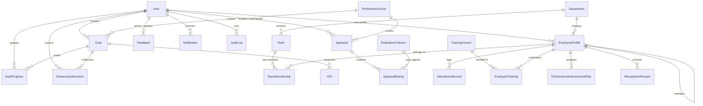

# DATABASE DESIGN DOCUMENTATION
## Intern Performance Management System (PMS)
**Target Engine:** PostgreSQL 16+  
**Architecture:** Relational, Normalized 3NF, UUID Primary Keys  
**Author:** Senior Database Architect  

---

## 1. Entity-Relationship Overview

---

## 2. Core Tables and Schema Definitions

### 2.1 Authentication & Organization

#### 1. `accounts_user`
Stores authentication credentials, user roles, and lifecycle timestamps.
* `id` (UUID, Primary Key, default `uuid_generate_v4()`)
* `username` (VARCHAR(150), Unique, Indexed)
* `email` (VARCHAR(254), Unique, Indexed)
* `password` (VARCHAR(128), Django PBKDF2/Argon2 password hash)
* `role` (VARCHAR(20), Enum: `SUPER_ADMIN`, `HR`, `MANAGER`, `INTERN`, Indexed)
* `is_active` (BOOLEAN, default `TRUE`)
* `is_staff` (BOOLEAN, default `FALSE`)
* `is_superuser` (BOOLEAN, default `FALSE`)
* `date_joined` (TIMESTAMPTZ, default `NOW()`)
* `last_login` (TIMESTAMPTZ, Nullable)
* `updated_at` (TIMESTAMPTZ, default `NOW()`)

#### 2. `organization_department`
Represents corporate departments.
* `id` (UUID, Primary Key)
* `name` (VARCHAR(100), Unique, Indexed)
* `description` (TEXT, Nullable)
* `is_active` (BOOLEAN, default `TRUE`)
* `created_at` (TIMESTAMPTZ, default `NOW()`)
* `updated_at` (TIMESTAMPTZ, default `NOW()`)

#### 3. `organization_team`
Represents sub-teams within departments.
* `id` (UUID, Primary Key)
* `department_id` (UUID, FK -> `organization_department.id`, ON DELETE CASCADE)
* `manager_id` (UUID, FK -> `accounts_user.id`, ON DELETE SET NULL, Nullable)
* `name` (VARCHAR(100))
* `description` (TEXT, Nullable)
* `created_at` (TIMESTAMPTZ, default `NOW()`)
* `updated_at` (TIMESTAMPTZ, default `NOW()`)
* *Unique Constraint:* `(department_id, name)`

#### 4. `employees_employeeprofile`
Extended organizational and personal metadata for users.
* `id` (UUID, Primary Key)
* `user_id` (UUID, FK -> `accounts_user.id`, Unique, ON DELETE CASCADE)
* `employee_code` (VARCHAR(50), Unique, Indexed)
* `first_name` (VARCHAR(100))
* `last_name` (VARCHAR(100))
* `department_id` (UUID, FK -> `organization_department.id`, ON DELETE SET NULL, Nullable)
* `manager_id` (UUID, FK -> `accounts_user.id`, ON DELETE SET NULL, Nullable, Indexed)
* `designation` (VARCHAR(100))
* `joining_date` (DATE)
* `employment_status` (VARCHAR(20), Enum: `ACTIVE`, `PROBATION`, `COMPLETED`, `TERMINATED`)
* `phone_number` (VARCHAR(20), Nullable)
* `emergency_contact` (TEXT, Nullable)
* `created_at` (TIMESTAMPTZ, default `NOW()`)
* `updated_at` (TIMESTAMPTZ, default `NOW()`)

#### 5. `organization_teammembership`
Many-to-many relationship between teams and employee profiles.
* `id` (UUID, Primary Key)
* `team_id` (UUID, FK -> `organization_team.id`, ON DELETE CASCADE)
* `employee_id` (UUID, FK -> `employees_employeeprofile.id`, ON DELETE CASCADE)
* `is_lead` (BOOLEAN, default `FALSE`)
* `joined_at` (TIMESTAMPTZ, default `NOW()`)
* *Unique Constraint:* `(team_id, employee_id)`

---

### 2.2 Performance Management

#### 6. `performance_performancecycle`
Configures time-bound appraisal intervals (e.g. "Q3 2026 Intern Cycle").
* `id` (UUID, Primary Key)
* `name` (VARCHAR(150), Unique)
* `description` (TEXT, Nullable)
* `start_date` (DATE)
* `end_date` (DATE)
* `status` (VARCHAR(20), Enum: `DRAFT`, `ACTIVE`, `REVIEW_PERIOD`, `CLOSED`, Indexed)
* `created_by_id` (UUID, FK -> `accounts_user.id`, ON DELETE SET NULL)
* `created_at` (TIMESTAMPTZ, default `NOW()`)
* `updated_at` (TIMESTAMPTZ, default `NOW()`)
* *Check Constraint:* `end_date >= start_date`

#### 7. `goals_goal`
Key goals assigned to an employee/intern for a specific cycle.
* `id` (UUID, Primary Key)
* `employee_id` (UUID, FK -> `employees_employeeprofile.id`, ON DELETE CASCADE, Indexed)
* `cycle_id` (UUID, FK -> `performance_performancecycle.id`, ON DELETE CASCADE, Indexed)
* `assigned_by_id` (UUID, FK -> `accounts_user.id`, ON DELETE SET NULL)
* `title` (VARCHAR(255))
* `description` (TEXT)
* `due_date` (DATE)
* `status` (VARCHAR(20), Enum: `NOT_STARTED`, `IN_PROGRESS`, `SUBMITTED`, `COMPLETED`, `CANCELLED`, Indexed)
* `priority` (VARCHAR(10), Enum: `LOW`, `MEDIUM`, `HIGH`, `CRITICAL`)
* `completion_percentage` (DECIMAL(5, 2), default `0.00`)
* `created_at` (TIMESTAMPTZ, default `NOW()`)
* `updated_at` (TIMESTAMPTZ, default `NOW()`)
* *Check Constraint:* `completion_percentage >= 0 AND completion_percentage <= 100`

#### 8. `goals_kpi`
Measurable quantitative indicator attached to a Goal.
* `id` (UUID, Primary Key)
* `goal_id` (UUID, FK -> `goals_goal.id`, ON DELETE CASCADE, Indexed)
* `name` (VARCHAR(255))
* `description` (TEXT, Nullable)
* `target_value` (DECIMAL(12, 2))
* `achieved_value` (DECIMAL(12, 2), default `0.00`)
* `unit` (VARCHAR(50), e.g. "PRs", "Hours", "%", "Bugs fixed")
* `measurement_type` (VARCHAR(20), Enum: `NUMERIC`, `PERCENTAGE`, `CURRENCY`, `BOOLEAN`)
* `created_at` (TIMESTAMPTZ, default `NOW()`)
* `updated_at` (TIMESTAMPTZ, default `NOW()`)

#### 9. `goals_goalprogress`
Audit log of progress milestones for a goal.
* `id` (UUID, Primary Key)
* `goal_id` (UUID, FK -> `goals_goal.id`, ON DELETE CASCADE, Indexed)
* `updated_by_id` (UUID, FK -> `accounts_user.id`, ON DELETE SET NULL)
* `progress_percentage` (DECIMAL(5, 2))
* `comment` (TEXT)
* `created_at` (TIMESTAMPTZ, default `NOW()`)

#### 10. `performance_evaluationcriterion`
Configurable scoring criteria with maximum scores and weights.
* `id` (UUID, Primary Key)
* `name` (VARCHAR(150), Unique)
* `description` (TEXT)
* `maximum_score` (DECIMAL(5, 2), default `100.00`)
* `weight` (DECIMAL(5, 2), e.g. `25.00` representing 25%)
* `is_active` (BOOLEAN, default `TRUE`)
* `created_at` (TIMESTAMPTZ, default `NOW()`)
* `updated_at` (TIMESTAMPTZ, default `NOW()`)

#### 11. `performance_appraisal`
Comprehensive evaluation instance for an intern within a cycle.
* `id` (UUID, Primary Key)
* `employee_id` (UUID, FK -> `employees_employeeprofile.id`, ON DELETE CASCADE, Indexed)
* `cycle_id` (UUID, FK -> `performance_performancecycle.id`, ON DELETE CASCADE, Indexed)
* `reviewer_id` (UUID, FK -> `accounts_user.id`, ON DELETE SET NULL, Indexed)
* `appraisal_type` (VARCHAR(20), Enum: `SELF`, `MANAGER`, `ANNUAL_REVIEW`)
* `status` (VARCHAR(20), Enum: `DRAFT`, `SUBMITTED`, `UNDER_REVIEW`, `HR_APPROVED`, `PUBLISHED`, Indexed)
* `overall_score` (DECIMAL(5, 2), Nullable)
* `self_comments` (TEXT, Nullable)
* `reviewer_comments` (TEXT, Nullable)
* `final_comments` (TEXT, Nullable)
* `submitted_at` (TIMESTAMPTZ, Nullable)
* `published_at` (TIMESTAMPTZ, Nullable)
* `created_at` (TIMESTAMPTZ, default `NOW()`)
* `updated_at` (TIMESTAMPTZ, default `NOW()`)
* *Unique Constraint:* `(employee_id, cycle_id, appraisal_type)`

#### 12. `performance_appraisalrating`
Specific criterion score within an appraisal.
* `id` (UUID, Primary Key)
* `appraisal_id` (UUID, FK -> `performance_appraisal.id`, ON DELETE CASCADE)
* `criterion_id` (UUID, FK -> `performance_evaluationcriterion.id`, ON DELETE CASCADE)
* `score` (DECIMAL(5, 2))
* `comments` (TEXT, Nullable)
* *Unique Constraint:* `(appraisal_id, criterion_id)`

#### 13. `feedback_feedback`
Peer and manager coaching notes.
* `id` (UUID, Primary Key)
* `sender_id` (UUID, FK -> `accounts_user.id`, ON DELETE CASCADE, Indexed)
* `recipient_id` (UUID, FK -> `accounts_user.id`, ON DELETE CASCADE, Indexed)
* `goal_id` (UUID, FK -> `goals_goal.id`, ON DELETE SET NULL, Nullable)
* `feedback_type` (VARCHAR(20), Enum: `PRAISE`, `COACHING`, `SUGGESTION`, `GENERAL`)
* `message` (TEXT)
* `visibility` (VARCHAR(20), Enum: `PUBLIC`, `MANAGER_ONLY`, `PRIVATE`)
* `created_at` (TIMESTAMPTZ, default `NOW()`)
* `updated_at` (TIMESTAMPTZ, default `NOW()`)

---

### 2.3 Supporting Features

#### 14. `evidence_evidencesubmission`
Verification deliverables attached by interns to demonstrate goal achievements.
* `id` (UUID, Primary Key)
* `employee_id` (UUID, FK -> `employees_employeeprofile.id`, ON DELETE CASCADE, Indexed)
* `goal_id` (UUID, FK -> `goals_goal.id`, ON DELETE CASCADE, Indexed)
* `title` (VARCHAR(255))
* `description` (TEXT)
* `file_attachment` (VARCHAR(255), Nullable)
* `external_url` (VARCHAR(500), Nullable)
* `review_status` (VARCHAR(20), Enum: `PENDING`, `APPROVED`, `REJECTED`, `REVISION_REQUESTED`, default `PENDING`, Indexed)
* `review_notes` (TEXT, Nullable)
* `reviewed_by_id` (UUID, FK -> `accounts_user.id`, ON DELETE SET NULL, Nullable)
* `reviewed_at` (TIMESTAMPTZ, Nullable)
* `created_at` (TIMESTAMPTZ, default `NOW()`)
* `updated_at` (TIMESTAMPTZ, default `NOW()`)

#### 15. `attendance_attendancerecord`
Daily presence records.
* `id` (UUID, Primary Key)
* `employee_id` (UUID, FK -> `employees_employeeprofile.id`, ON DELETE CASCADE, Indexed)
* `attendance_date` (DATE, Indexed)
* `status` (VARCHAR(20), Enum: `PRESENT`, `ABSENT`, `HALF_DAY`, `ON_LEAVE`)
* `check_in` (TIMESTAMPTZ, Nullable)
* `check_out` (TIMESTAMPTZ, Nullable)
* `remarks` (TEXT, Nullable)
* `created_at` (TIMESTAMPTZ, default `NOW()`)
* *Unique Constraint:* `(employee_id, attendance_date)`

#### 16. `training_trainingcourse`
Course catalog available for intern onboarding and upskilling.
* `id` (UUID, Primary Key)
* `title` (VARCHAR(255))
* `description` (TEXT)
* `provider` (VARCHAR(150))
* `duration_hours` (DECIMAL(5, 1))
* `is_active` (BOOLEAN, default `TRUE`)
* `created_at` (TIMESTAMPTZ, default `NOW()`)

#### 17. `training_employeetraining`
Intern enrollment and course progression.
* `id` (UUID, Primary Key)
* `employee_id` (UUID, FK -> `employees_employeeprofile.id`, ON DELETE CASCADE, Indexed)
* `course_id` (UUID, FK -> `training_trainingcourse.id`, ON DELETE CASCADE, Indexed)
* `enrollment_status` (VARCHAR(20), Enum: `ENROLLED`, `IN_PROGRESS`, `COMPLETED`, `DROPPED`)
* `completion_percentage` (DECIMAL(5, 2), default `0.00`)
* `completion_date` (DATE, Nullable)
* `created_at` (TIMESTAMPTZ, default `NOW()`)
* *Unique Constraint:* `(employee_id, course_id)`

#### 18. `performance_performanceimprovementplan`
Structured correction programs for underperforming interns.
* `id` (UUID, Primary Key)
* `employee_id` (UUID, FK -> `employees_employeeprofile.id`, ON DELETE CASCADE, Indexed)
* `created_by_id` (UUID, FK -> `accounts_user.id`, ON DELETE SET NULL)
* `reason` (TEXT)
* `objectives` (TEXT)
* `start_date` (DATE)
* `end_date` (DATE)
* `status` (VARCHAR(20), Enum: `ACTIVE`, `IN_PROGRESS`, `SUCCESSFUL`, `EXTENDED`, `TERMINATED`, Indexed)
* `review_notes` (TEXT, Nullable)
* `created_at` (TIMESTAMPTZ, default `NOW()`)
* `updated_at` (TIMESTAMPTZ, default `NOW()`)

#### 19. `performance_recognitionreward`
Awards for exceptional performance.
* `id` (UUID, Primary Key)
* `recipient_id` (UUID, FK -> `accounts_user.id`, ON DELETE CASCADE, Indexed)
* `awarded_by_id` (UUID, FK -> `accounts_user.id`, ON DELETE SET NULL)
* `title` (VARCHAR(200))
* `description` (TEXT)
* `awarded_at` (TIMESTAMPTZ, default `NOW()`)

#### 20. `notifications_notification`
System alerts and push triggers.
* `id` (UUID, Primary Key)
* `recipient_id` (UUID, FK -> `accounts_user.id`, ON DELETE CASCADE, Indexed)
* `title` (VARCHAR(255))
* `message` (TEXT)
* `notification_type` (VARCHAR(50), Enum: `GOAL_ASSIGNED`, `EVIDENCE_REVIEWED`, `APPRAISAL_PUBLISHED`, `SYSTEM`)
* `is_read` (BOOLEAN, default `FALSE`, Indexed)
* `created_at` (TIMESTAMPTZ, default `NOW()`)

#### 21. `audit_auditlog`
Administrative and security mutation audit trail.
* `id` (UUID, Primary Key)
* `actor_id` (UUID, FK -> `accounts_user.id`, ON DELETE SET NULL, Nullable, Indexed)
* `action` (VARCHAR(50), e.g. `CREATE`, `UPDATE`, `DELETE`, `PUBLISH`, `LOGIN`, Indexed)
* `entity_type` (VARCHAR(100), Indexed)
* `entity_id` (VARCHAR(100), Nullable)
* `metadata` (JSONB, default `{}`)
* `ip_address` (VARCHAR(45), Nullable)
* `timestamp` (TIMESTAMPTZ, default `NOW()`, Indexed)

---

## 3. Data Integrity & Constraints Summary

| Table | Constraint | Purpose |
|---|---|---|
| `attendance_attendancerecord` | `UNIQUE(employee_id, attendance_date)` | Prevents multiple records on same day |
| `training_employeetraining` | `UNIQUE(employee_id, course_id)` | Prevents duplicate course enrollment |
| `organization_teammembership` | `UNIQUE(team_id, employee_id)` | Prevents duplicate team memberships |
| `performance_appraisalrating` | `UNIQUE(appraisal_id, criterion_id)` | Prevents duplicate rating for same criterion |
| `goals_goal` | `CHECK (completion_percentage >= 0 AND completion_percentage <= 100)` | Enforces valid completion % |
| `performance_performancecycle` | `CHECK (end_date >= start_date)` | Enforces temporal validity |
