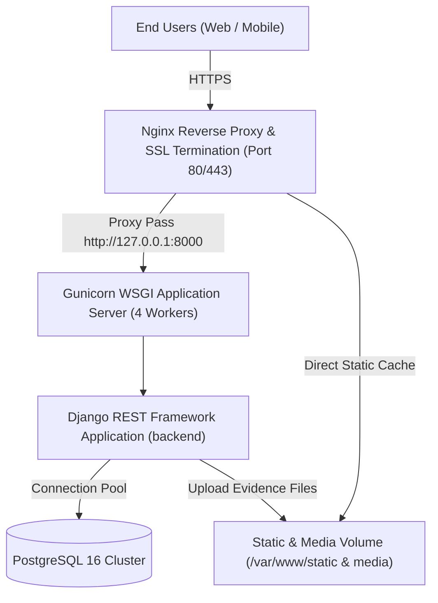

# Deployment & Production Operations Guide — Intern PMS

## 1. Production Architecture Overview

In production, the **Intern Performance Management System (PMS)** is deployed using containerized microservices managed via Docker Compose or Kubernetes:



---

## 2. Dockerfile Specification (`backend/Dockerfile`)

```dockerfile
# Multi-stage production build
FROM python:3.11-slim as builder

ENV PYTHONUNBUFFERED=1 \
    PYTHONDONTWRITEBYTECODE=1 \
    PIP_NO_CACHE_DIR=off

WORKDIR /app

# Install system build dependencies for psycopg2
RUN apt-get update && apt-get install -y --no-install-recommends \
    build-essential \
    libpq-dev \
    curl \
    && rm -rf /var/lib/apt/lists/*

COPY requirements.txt .
RUN pip install --user -r requirements.txt

# Final runtime image
FROM python:3.11-slim

ENV PYTHONUNBUFFERED=1 \
    PYTHONDONTWRITEBYTECODE=1 \
    PATH=/root/.local/bin:$PATH

WORKDIR /app

RUN apt-get update && apt-get install -y --no-install-recommends \
    libpq5 \
    curl \
    && rm -rf /var/lib/apt/lists/*

COPY --from=builder /root/.local /root/.local
COPY . .

# Collect static files during build
RUN python manage.py collectstatic --noinput

EXPOSE 8000

CMD ["gunicorn", "--config", "gunicorn.conf.py", "config.wsgi:application"]
```

---

## 3. Docker Compose (`docker-compose.production.yml`)

```yaml
version: '3.8'

services:
  db:
    image: postgres:16-alpine
    restart: always
    environment:
      POSTGRES_DB: intern_pms_prod_db
      POSTGRES_USER: intern_pms_prod_user
      POSTGRES_PASSWORD: ${DB_PASSWORD}
    volumes:
      - postgres_data:/var/lib/postgresql/data
    networks:
      - pms-internal-net
    healthcheck:
      test: ["CMD-SHELL", "pg_isready -U intern_pms_prod_user -d intern_pms_prod_db"]
      interval: 10s
      timeout: 5s
      retries: 5

  backend:
    build:
      context: ./backend
      dockerfile: Dockerfile
    restart: always
    environment:
      DEBUG: "False"
      SECRET_KEY: ${SECRET_KEY}
      ALLOWED_HOSTS: ${ALLOWED_HOSTS}
      DB_NAME: intern_pms_prod_db
      DB_USER: intern_pms_prod_user
      DB_PASSWORD: ${DB_PASSWORD}
      DB_HOST: db
      DB_PORT: "5432"
      CORS_ALLOWED_ORIGINS: ${CORS_ALLOWED_ORIGINS}
    depends_on:
      db:
        condition: service_healthy
    volumes:
      - static_volume:/app/static_collected
      - media_volume:/app/media
    networks:
      - pms-internal-net

  nginx:
    image: nginx:alpine
    restart: always
    ports:
      - "80:80"
      - "443:443"
    volumes:
      - ./nginx/prod.conf:/etc/nginx/conf.d/default.conf
      - ./nginx/ssl:/etc/nginx/ssl
      - static_volume:/var/www/static
      - media_volume:/var/www/media
    depends_on:
      - backend
    networks:
      - pms-internal-net

volumes:
  postgres_data:
  static_volume:
  media_volume:

networks:
  pms-internal-net:
    driver: bridge
```

---

## 4. Production Gunicorn Configuration (`backend/gunicorn.conf.py`)

```python
import multiprocessing

bind = "0.0.0.0:8000"
workers = multiprocessing.cpu_count() * 2 + 1
worker_class = "sync"
timeout = 60
keepalive = 5
max_requests = 1000
max_requests_jitter = 50

accesslog = "-"
errorlog = "-"
loglevel = "info"
```

---

## 5. Nginx Reverse Proxy Configuration (`nginx/prod.conf`)

```nginx
upstream django_backend {
    server backend:8000;
}

server {
    listen 80;
    server_name pms.company.com;
    return 301 https://$host$request_uri;
}

server {
    listen 443 ssl http2;
    server_name pms.company.com;

    ssl_certificate /etc/nginx/ssl/live/pms.company.com/fullchain.pem;
    ssl_certificate_key /etc/nginx/ssl/live/pms.company.com/privkey.pem;

    # Security Headers
    add_header X-Frame-Options "DENY" always;
    add_header X-Content-Type-Options "nosniff" always;
    add_header X-XSS-Protection "1; mode=block" always;
    add_header Referrer-Policy "strict-origin-when-cross-origin" always;
    add_header Strict-Transport-Security "max-age=31536000; includeSubDomains; preload" always;

    client_max_body_size 25M;

    # Static files
    location /static/ {
        alias /var/www/static/;
        expires 30d;
        add_header Cache-Control "public, no-transform";
    }

    # Evidence media uploads
    location /media/ {
        alias /var/www/media/;
        expires 7d;
        add_header Cache-Control "private";
    }

    # API and Admin routes
    location / {
        proxy_pass http://django_backend;
        proxy_set_header Host $host;
        proxy_set_header X-Real-IP $remote_addr;
        proxy_set_header X-Forwarded-For $proxy_add_x_forwarded_for;
        proxy_set_header X-Forwarded-Proto $scheme;
        proxy_redirect off;
    }
}
```

---

## 6. Database Backup & Recovery Procedures

### 6.1 Automated Daily Backups
```bash
# Backup PostgreSQL database to compressed archive
TIMESTAMP=$(date +"%Y%m%d_%H%M%S")
docker exec -t $(docker ps -qf "name=db") pg_dump -U intern_pms_prod_user -F c intern_pms_prod_db > /backup/intern_pms_db_${TIMESTAMP}.dump

# Retain last 30 days of backups
find /backup -type f -name "*.dump" -mtime +30 -exec rm {} \;
```

### 6.2 Disaster Recovery / Restoration
```bash
# Terminate existing active connections and recreate database
docker exec -i $(docker ps -qf "name=db") psql -U intern_pms_prod_user -c "SELECT pg_terminate_backend(pid) FROM pg_stat_activity WHERE datname = 'intern_pms_prod_db';"
docker exec -i $(docker ps -qf "name=db") dropdb -U intern_pms_prod_user intern_pms_prod_db
docker exec -i $(docker ps -qf "name=db") createdb -U intern_pms_prod_user intern_pms_prod_db

# Restore from dump file
cat /backup/intern_pms_db_20250601_120000.dump | docker exec -i $(docker ps -qf "name=db") pg_restore -U intern_pms_prod_user -d intern_pms_prod_db -v
```
