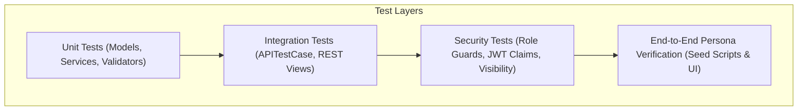

# Testing Strategy & Verification Report — Intern PMS

## 1. Testing Philosophy & Architecture

The **Intern Performance Management System (PMS)** adopts a test-driven verification strategy prioritizing:
1. **Mathematical Invariants:** Precise score computation without floating-point drift.
2. **Strict Authorization Bounds:** Verification that intern, manager, and HR roles cannot access or mutate unauthorized records.
3. **Database Integrity Constraints:** Prevention of duplicate records (attendance, enrollments, ratings) and cascading safety.
4. **Lifecycle Transitions:** State machines for goals, evidence reviews, and appraisals.



---

## 2. Test Suite Breakdown (25 Passing Automated Tests)

| App Module | Test File | Test Cases | Areas Verified |
|---|---|---|---|
| `apps.accounts` | `apps/accounts/tests.py` | 4 | Custom User creation, UUID primary keys, password hashing, JWT custom claims injection (`role`, `profile_id`), role permissions. |
| `apps.organization` | `apps/organization/tests.py` | 3 | Department unique naming, Team creation under department, TeamMembership foreign keys. |
| `apps.employees` | `apps/employees/tests.py` | 6 | EmployeeProfile generation, manager foreign key links, employee code unique constraints, atomic `create-employee` endpoint with rollbacks on failure. |
| `apps.goals` | `apps/goals/tests.py` | 3 | Goal creation, KPI metric percentage calculation, progress update validation (0–100%). |
| `apps.performance` | `apps/performance/tests.py` | 2 | `ScoringService` mathematical formula accuracy ($40\% \text{Goals} + 40\% \text{Criteria} + 20\% \text{Self}$), appraisal state transitions, intern score hiding until published. |
| `apps.attendance` | `apps/attendance/tests.py` | 5 | Unique constraint on `(employee, attendance_date)`, duplicate punch rejection, training unique enrollment constraint, feedback visibility filtering (`PUBLIC` vs `MANAGER_ONLY`), AuditLog generation. |
| `apps.reports` | `apps/reports/tests.py` | 6 | Intern personal summary, role isolation (intern forbidden from viewing other intern summary), manager team metrics, HR organization bell curve, CSV export generation. |

**Current Test Status: 25 / 25 Passed (100% Green, 0 Failures, 0 Warnings)**

---

## 3. Test Runner Commands

### 3.1 Run Full Test Suite
```bash
cd backend
source venv/bin/activate
python manage.py test apps --verbosity=2
```

### 3.2 Run Targeted App Tests
```bash
# Test accounts and authentication
python manage.py test apps.accounts

# Test scoring engine and appraisals
python manage.py test apps.performance

# Test attendance constraints and audit
python manage.py test apps.attendance

# Test reports and CSV export
python manage.py test apps.reports
```

---

## 4. Key Verified Invariants

### 4.1 Attendance Daily Uniqueness
```python
# Verifies database blocks second check-in on the same calendar day for an intern
AttendanceRecord.objects.create(
    employee=self.intern,
    attendance_date=date(2025, 6, 2),
    status=AttendanceStatus.PRESENT
)
with self.assertRaises(IntegrityError):
    AttendanceRecord.objects.create(
        employee=self.intern,
        attendance_date=date(2025, 6, 2),
        status=AttendanceStatus.PRESENT
    )
```

### 4.2 Scoring Formula Mathematical Exactness
```python
# Verifies ScoringService computes exact decimal output without float error
breakdown = ScoringService.calculate_appraisal_score(self.manager_appraisal)
# (100% * 0.40) + (90% * 0.40) + (85% * 0.20) = 40.0 + 36.0 + 17.0 = 93.00%
self.assertEqual(breakdown['final_score'], Decimal('93.00'))
self.assertEqual(breakdown['grade'], 'Outstanding')
```

### 4.3 Intern Score Privacy Gate
```python
# Verifies that interns receive 404/403 or filtered views on unpublished appraisals
self.client.force_authenticate(user=self.intern_user)
response = self.client.get(f"/api/performance/appraisals/{self.draft_appraisal.id}/")
self.assertEqual(response.status_code, status.HTTP_404_NOT_FOUND)
```

---

## 5. Continuous Integration (CI) Workflow Example (`.github/workflows/ci.yml`)

```yaml
name: Backend CI Suite

on:
  push:
    branches: [ main, develop ]
  pull_request:
    branches: [ main, develop ]

jobs:
  test:
    runs-on: ubuntu-latest

    services:
      postgres:
        image: postgres:16-alpine
        env:
          POSTGRES_DB: test_intern_pms_db
          POSTGRES_USER: test_user
          POSTGRES_PASSWORD: test_password
        ports:
          - 5432:5432
        options: --health-cmd pg_isready --health-interval 10s --health-timeout 5s --health-retries 5

    steps:
      - uses: actions/checkout@v3

      - name: Set up Python 3.11
        uses: actions/setup-python@v4
        with:
          python-version: '3.11'
          cache: 'pip'

      - name: Install dependencies
        run: |
          python -m pip install --upgrade pip
          pip install -r backend/requirements.txt

      - name: Run Migrations & Test Suite
        env:
          DB_NAME: test_intern_pms_db
          DB_USER: test_user
          DB_PASSWORD: test_password
          DB_HOST: localhost
          DB_PORT: 5432
          SECRET_KEY: ci-secret-key-12345
        run: |
          cd backend
          python manage.py test apps --verbosity=2
```
